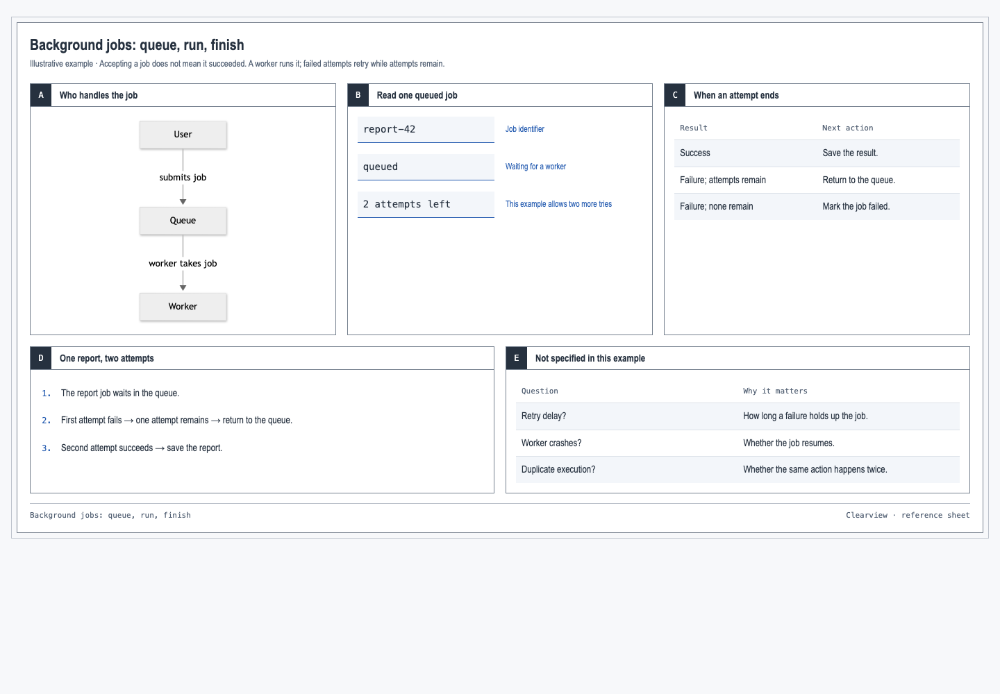
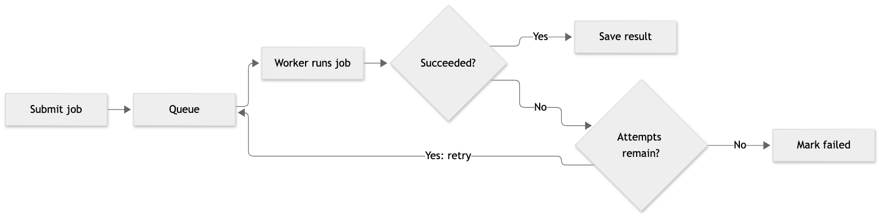

# clearview

turns agent work into a diagram, a visual reference sheet, or a web page.



## usage

copy the whole `clearview` folder into your agent's skills directory. Keep the
supporting files with `SKILL.md`, they're needed to render the output.

then ask for:

- “Use clearview to explain [subject] as a diagram.”
- “Use clearview to give me a visual reference sheet for [subject].”
- “Use clearview to explain [subject] as a web page with sections I can click to read more.”

you can also just say “Use Clearview to explain [subject]” and let the agent choose.

dumb disclaimer: explanation quality still depends on the model.

## one-time setup

- Python 3.10+
- Node.js 22.13+ and npm.

before generating your first diagram, run these commands from the `clearview` folder:

```sh
npm ci --ignore-scripts --no-audit --no-fund
npm run setup
```

fyi: dependencies stay in `node_modules` and the renderer's browser stays in
`.cache/puppeteer`. sandboxed agents may need permission to run that browser.

## render

```sh
python3 render.py explanation.json explanation.html
python3 render.py explanation.mmd explanation.svg
```

these commands turn the agent's files into the requested diagram or web page.

## views

- **Diagram:** [SVG](examples/diagram.svg) or [PNG](examples/diagram.png), for relationships and behavior at a glance.
- **Reference sheet:** [HTML](examples/sheet.html), with small diagrams, comparisons, and examples on one page.
- **Web page:** [HTML](examples/detail.html), with sections you can keep open together, clickable sources, and exact code or log excerpts.



## checks

from this folder:

```sh
python3 -m unittest discover -s . -p 'test_*.py'
node test_layout.mjs
```

checks cover rendering, input handling, and responsive layout.
